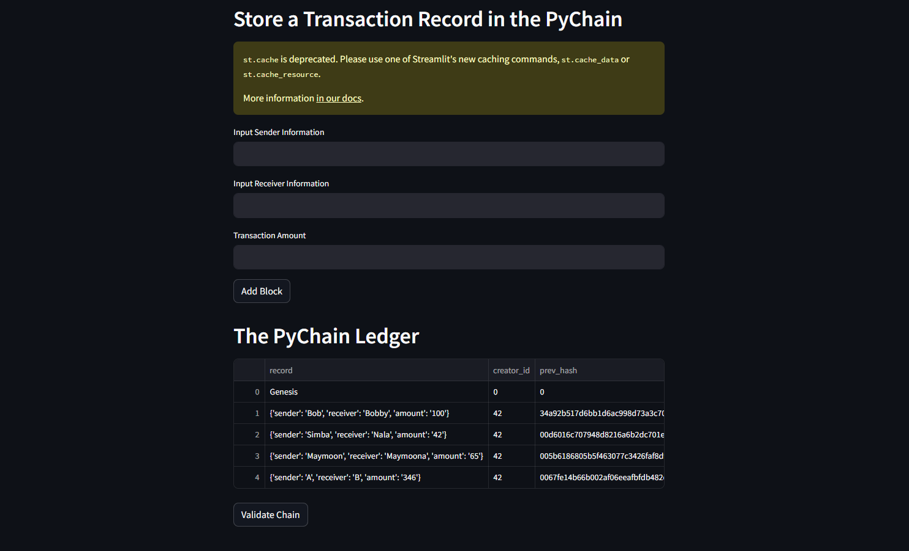
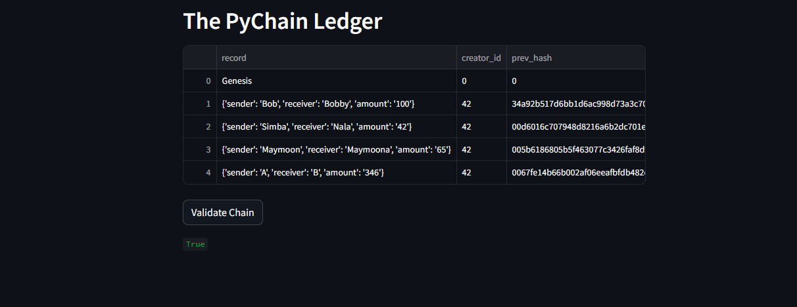

# Module-18-Challenge
In this repository you will find a .py file named Pychain, in this file we are a fintech engineer who’s working at one of the five largest banks in the world. We were recently promoted to act as the lead developer on their decentralized finance team. My task is to build a blockchain-based ledger system, complete with a user-friendly web interface. This ledger will allow partner banks to conduct financial transactions (that is, to transfer money between senders and receivers) and to verify the integrity of the data in the ledger.
# Part 1 Create a Record Data Class
We'll create a new Python data class called Record. Create a new class called Record. Add the dataclass decorator just before the Record class definition. Add a sender attribute of type str. Add a string-type attribute named receiver. Add a float-type attribute named amount.

# Part 2 Modify the Existing Block Data Class to Store Record Data
In this step, we will change the data attribute in the Block class to record and configure it to use an instance of the new Record class that I built in the previous section. In the Block class, rename the data attribute to record. Change the data type of the record attribute to Record.

# Part 3 Add Relevant User Inputs to the Streamlit Interface
To record the sender, recipient, and amount for every transaction in the Block record, we will build input sections in this section. From the Streamlit interface, remove the input_data variable. Include an input field where users can enter a value to be used as the sender. Include a place for user input so that you may obtain a value for the recipient. Include a field for input where users can enter a value for the amount.

# Part 4  Test the PyChain Ledger by Storing Records

Lastly, testing my PyChain ledger and user interface by running Streamlit application and storing mined blocks in my PyChain ledger. Then test the blockchain validation process by using my PyChain ledger.

Enter values for the sender, receiver, and amount. 
Verify the block contents and hashes in the Streamlit drop-down menu. 
Test the blockchain validation process by using the web interface. 

